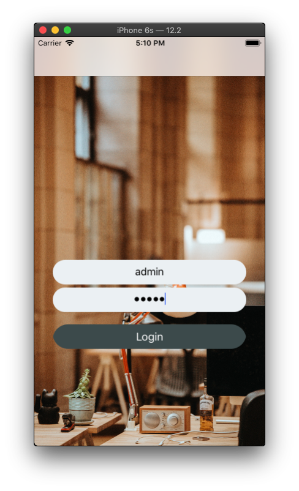
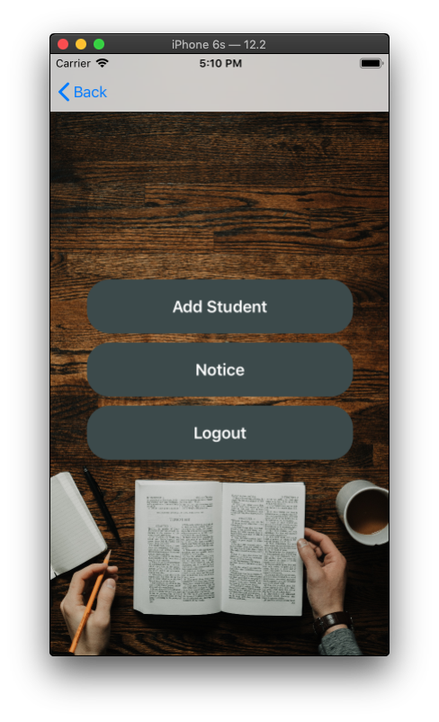
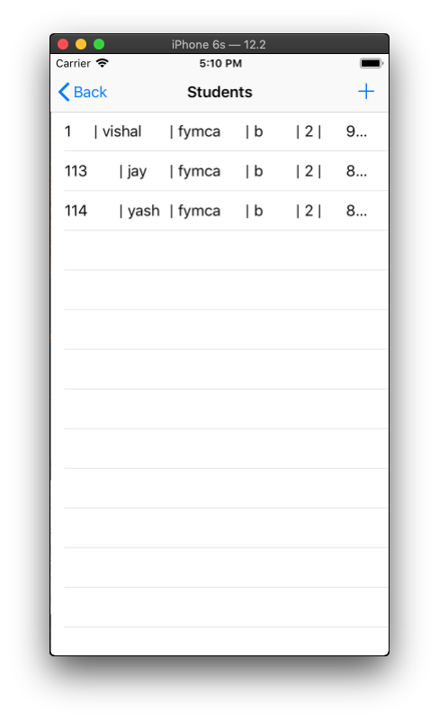
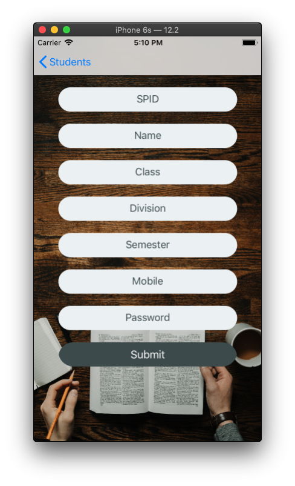
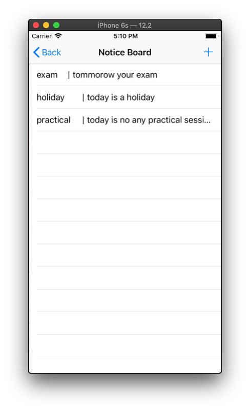
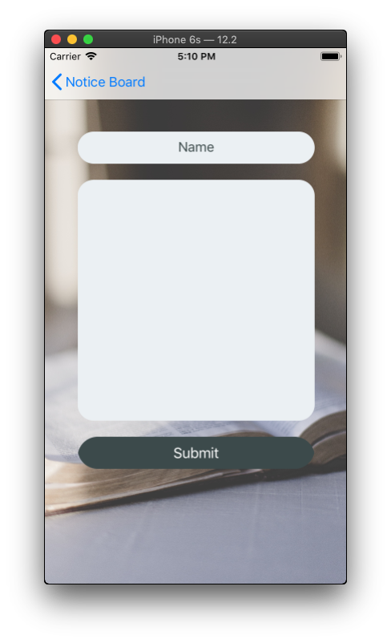
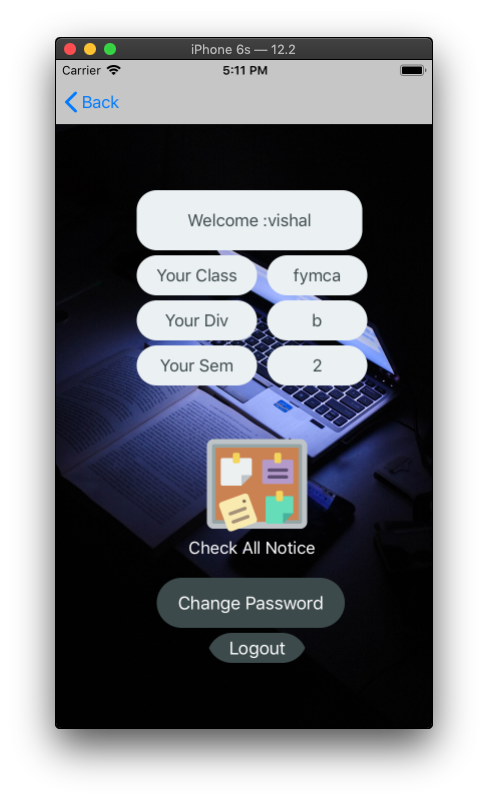
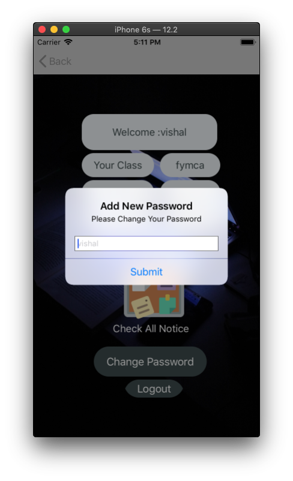

# StudentAdmissionCoreDataApp
 Simple Admission App using CoreData

#### UIElements
 
 - UILabel
 - UIButton
 - UIImageView
 - UITextField
 - UITextView
 - UITableView
 - UIAlertController
 
 ## How StudentAdmissionCoreDataApp Work

 
 
 ### Output
  - Login Page With Validation And UserDefaults

  - Admin Page

 - Student List (Show existing Student and also Add,Update and Remove Student)
 

 - Add Student Page
 

 - Notice Page (Show existing Notice and also Add,Update and Remove Notice)

 - Add New notice and Update Notice

- Student Page

- Change Password

 
